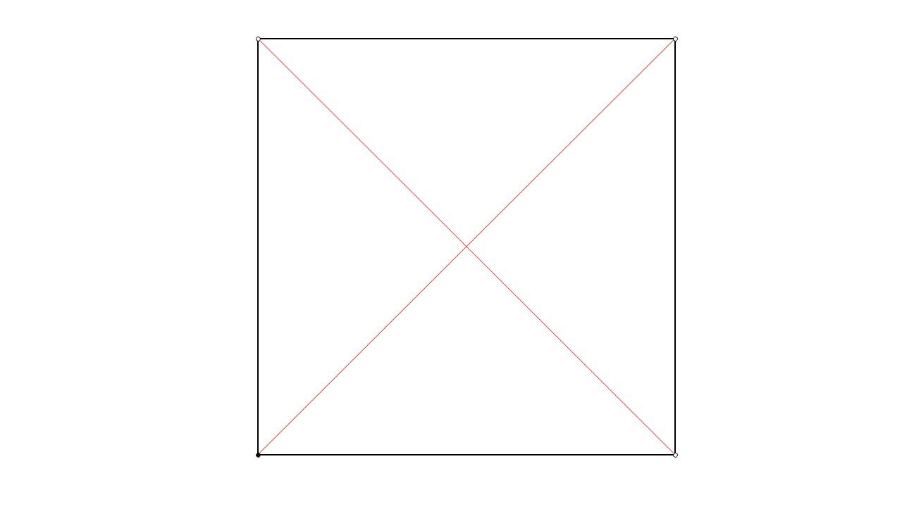
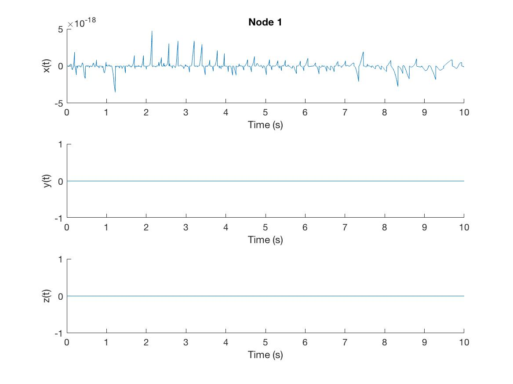
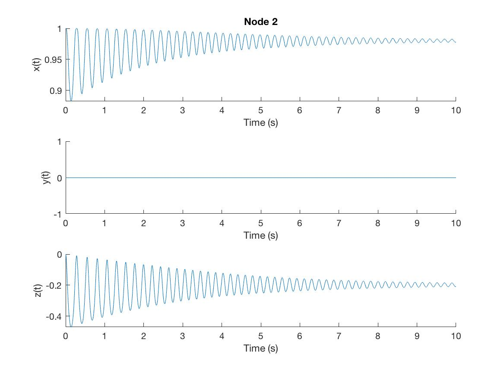
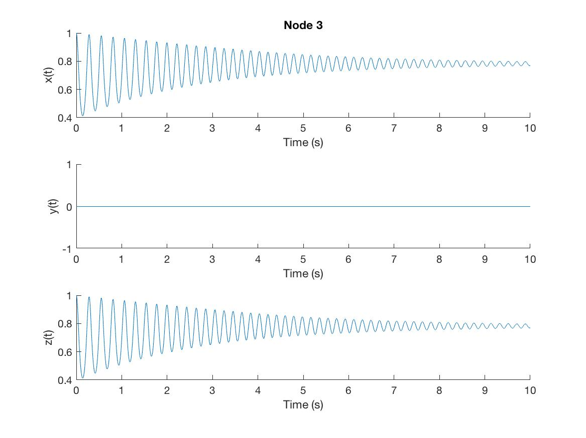
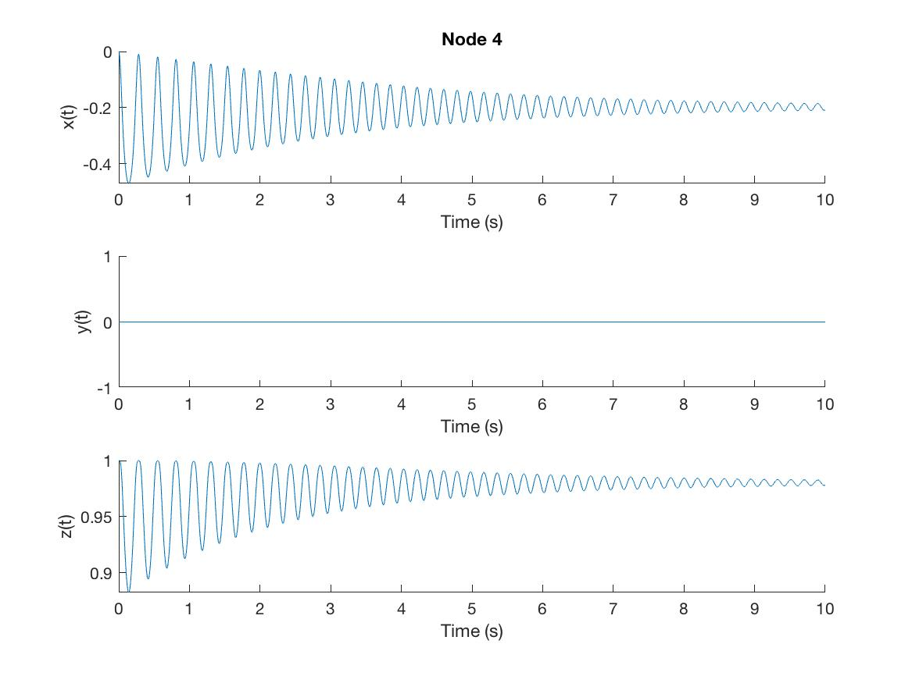
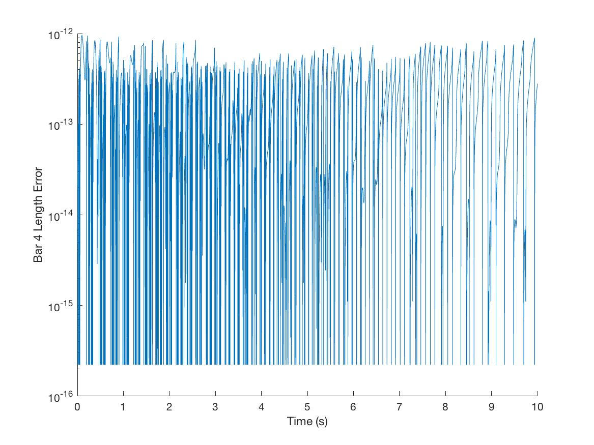
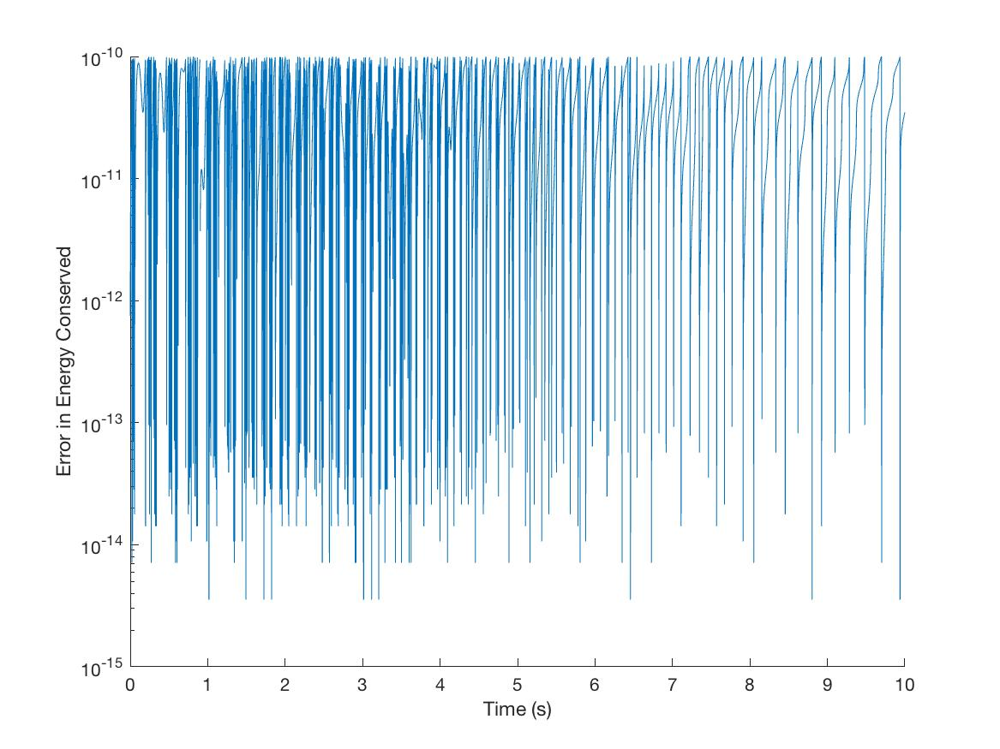

<!-- ---
header-includes:
  - \usepackage{amsmath, amssymb, graphicx, fullpage, color, subfigure, wrapfig, epstopdf, diagbox}
  - \newcommand{\real}{\mathbb{R}}
  - \newcommand{\ith}[1]{#1^{\text{th}}}
  - \newcommand{\vo}[1]{\boldsymbol{#1}}
  - \newcommand{\Rq}{\vo{R}_{\vo{q}}}

  - \newcommand{\comment}[1]{\textcolor{red}{#1}}
  - \newcommand{\bcg}{\bar{\vo{b}}_k}
  - \newcommand{\bcgd}{\dot{\bar{\vo{b}}}_k}
  - \newcommand{\bcgdd}{\ddot{\bar{\vo{b}}}_k}

  - \newcommand{\bv}{\vo{b}_k}
  - \newcommand{\bvd}{\dot{\vo{b}}_k}
  - \newcommand{\bvdd}{\ddot{\vo{b}}_k}

  - \newcommand{\q}{\vo{q}}
  - \newcommand{\qd}{\dot{\q}}

  - \newcommand{\eqnlabel}[1]{\label{eqn:#1}}
  - \newcommand{\eqn}[1]{(\ref{eqn:#1})}
  - \renewcommand{\vec}[1]{\boldsymbol{\mathsf{vec}}\left({#1}\right)}


---
-->
# User Guide

## Introduction
A tensegrity system is an arrangement of axially-loaded elements (no element bends, even though the overall structure bends), that we loosely characterize as a network of bars and cables. The bars take compressive axial loads and the cables handle tensile loads. Since failure due to axial stresses happens at higher loads than at bending, a tensegrity structure has a higher strength-to-weight ratio. Famous architect Buckminster Fuller in the 60’s coined the term tensegrity, combining the words tensile and integrity. Since then, tensegrity principles have found applications in diverse domains.

The dynamics of tensegrity systems is governed by multi-body dynamics, given by a set of ordinary differential equations. We have developed a Lagrangian formulation based on Cartesian coordinates for deriving DAEs of the governing equations of motion in a tensegrity framework for both rigid and elastic bars. A novel technique for improving the accuracy of the simulation has also been implemented to ensure that the errors in states arising from numerical integration are corrected on the position and velocity levels according to both geometric and energy constraints.

## Example:
A common example of a tensegrity system is that of a D-Bar.


A DBar is a tensegrity system of 4 bars (in black) and 2 strings (in red) connected as shown above. The initial nodal configuration, the connectivity matrices, the material and geometric properties as well as the simulation environment properties are described below in further detail.
The user is recommended to go through Template_DBar.m in the examples folder to view the entire source file for the following inputs.

## Inputs Required from the User:
All parameters are to be declared in SI units.
1. **N**: A matrix of the size *(3 x nNodes)* <!----><!--($\in \mathbb{R}^{3 \times n}$)--> defines the initial nodal configuration of the structure.
    ```matlab
    N = [0      1     1     0;
         0      0     0     0;
         0      0     1     1;];
    % Structure of N:
    % N = [%N1 %N2 %N3 ..]
    %      N1x N2x N3x ..;
    %      N1y N2y N3y ..;
    %      N1z N2z N3z ..;];
    ```
2. **C**: A matrix of size *(m x nNodes)* <!----><!--($\in \mathbb{R}^{m \times n}$)--> defines the connectivity matrix describing the network locations of *m* <!----><!-- $m$ --> bars and strings.
Specifically, if the kth <!----><!--$k^{th}$--> member is defined by connecting nodes *n(i)* <!----><!--$n_i$--> and *n(j)*, <!----><!--$n_j$-->
 *C(k,i) = -1, C(k,j) = 1*. All other elements in the kth row should be zero.

    There are two ways the user can characterize these matrices:
    * Define *C = [Cb; Cs];*, i.e., the connectivity matrix of bars followed by that of strings.
    It would then be necessary to define *nBar* (number of bars) and *nStr* (number of Strings), so that the following code can run to output *Cb* and *Cs*.

      ```matlab
      C = [ 1  0  0 -1;
           -1  1  0  0;
            0 -1  1  0;
            0  0 -1  1;
            0 -1  0  1;
           -1  0  1  0;]; % Connectivity Matrix C := [Cb; Cs];
      nBar = 4; % Number of bars
      nStr = 2; % Number of strings

      bars.index = 1:nBar; % To be used in constructing Cb
      strings.index = nBar+1:nBar+nStr; % To be used in constructing Cs

      Cb = C(bars.index,:); % Outputs connectivity matrix for bars
      Cs = C(strings.index,:); % Outputs connectivity matrix for strings
      ```
    * The user can define *Cb* and *Cs* themselves.

      ```matlab
      % From TBar.m
      Cb = [-1  0  1  0;
           0 -1  0  1;];

      Cs = [-1  1  0  0;
           0 -1  1  0;
           0  0 -1  1;
           1  0  0 -1;];
      ```
3. **fixedNodes**: A matrix of the same size as *N* describes which nodes are fixed in which body-fixed axes. The elements are either 0 or 1: 0 implying free and 1 free. In the DBar example, the first node is pinned in the x, y, and z directions, but the other nodes are free.
    ```matlab
    fixedNodes = [1 1 1;zeros(3,3)]';
    % To identify which coordinates of a node are fixed
    % 1 - fixed, 0 - free
    % Matrix of the same size as N
    ```
4. **strings**: MATLAB structure containing fields to define material properties for the cables present in the tensegrity structure.
Strings are modeled as springs but unlike springs, they can only exert tensile force, not compressive.

      ```matlab
      strings.r = 1/1000*ones(1,tData.nStr); % Radius of strings
      strings.E = 7e7*ones(1,tData.nStr); % Young's Modulus of Nylon
      strings.rLP = [1 0.7];  % Rest length of the strings
      ```

      In this example, all strings have been assigned the same radius and Young's modulus, but the rest lengths are different. If the user wishes to define different properties to each cable, they will have to create a vector of the size *(1 x nStr)* with the strings assigned their individual properties accordingly.

      ```matlab
      % If nStr = 4,
      strings.r = [0.01 0.05 0.01 0.05];
      ```

      Rest length here is in percentage,i.e., 0.7 implies 70%. The rest lengths of the strings are 70% of the current length of the strings.
      **NOTE**: The rest lengths of the strings are a measure of the pre-stress in the structure. The lower the rest lengths, the more pre-stressed a structure is.
5. **bars**: MATLAB structure containing fields to define material properties of the bars present in the tensegrity structure.
Bars are modeled as cylinders with a specified density and radius.
      ```matlab
      bars.rho = 1; % Density of bars
      bars.r = 1; % Radius of bars.
      ```

6. **Mp**: Scalar or a vector field defining the masses of the point masses present in the structure. Keep in mind that point masses are added automatically to the structure depending on the connectivity matrices. Point masses are placed exclusively at those nodes to which no bars connect. The number of point masses is found in the function *tensegConstruct* and stored in the field *tData.nPm*.
      ```matlab
      Mp = 1/100*ones(1,tData.nPm);
      ```
    In this example, all point masses have been initialised with a mass of 10 g.

7. **g**: Gravity vector.
      ```matlab
      g = [0;0;-9.806];
      ```
      The user can choose to avoid having gravity in his simulation environment by making it a vector of zeros.

8. **tData.F**: Scalar with possible values: 0 and 1. If 0, no external force present. If 1, external forces are present in the environment and the user will have to accordingly create 2 files *extF_eq.m* and *ext_F.m* detailing the forces acting on the nodes at equilibrium and during simulation respectively. The reader is encouraged to go through the example files for the ball and arm for a better understanding of how this is done.
      ```matlab
      % From the ball example
      extF = 30*[zeros(9,1);sin(t);0;0;zeros(6,1);0;sin(t);0;0;0;sin(t);zeros(15,1)]; % external force during simulation
      extF = zeros(39,1); % external force at equilibrium (no external force initially)
      ```

9. **tData.Correction**: Scalar with possible values: 0, 1, and 2. . If 1, constraint correction will be inclusive of total energy correction. If 0, constraint violations corrected will be only those of linear constraints corresponding to fixed nodes and non-linear constraints corresponding to rigid bar lengths. For correctness, the user is recommended to keep this turned on at all times, i.e,
    ```matlab
    tData.Correction = 1;
    ```
    If the user wishes not to use constraint correction at all, then the value assigned to tData.Correction must be 2.

10. **tData.damper**: Vector field describing the damping coefficients of the strings present in the structure. In the following example, all the cables are initialized with a damping coefficient of 1.
    ```matlab
    tData.damper = ones(1,tData.nStr);
    ```
    The user is free to assign the cables with different damping coefficients. They will have to do it in the same manner as advised in the strings properties section.

11. **tData.minforce**: A scalar field that defines the lower bound for force densities in strings when solving for equilibrium in *tensegEq.m*. Required only when structure is not in equilibrium at *t=0*.

12. **options**: MATLAB structure containing properties to be passed on to the ODE solver. The user is encouraged to read MATLAB's [ODE] documentation to learn how to provide these inputs.
    ```matlab
    options = odeset('RelTol',1e-10,'AbsTol',1e-10,'Refine',1);
    ```
    **NOTE**: In this example, the *'Refine'* option lets the solver choose the output interval times automatically. If the user wishes to define output interval times themselves, they should ignore defining this attribute and assign a value when prompted.
    ```matlab
    Enter output time-step (e.g. 0.01):
    ```

13. **AZ** and **EL**: Input for the functions plot_configuration and animateTenseg. Represents the azimuth and the elevation angle in degrees, used to specify the viewpoint during plotting. The user is advised to look at MATLAB's [viewpoint] documentation on how to provide these inputs.
    ```matlab
    AZ = 0;
    EL = 0;
    ```

14. **axLims**: Input for the functions plot_configuration and animateTenseg. It lets the user define axis limits for the figure window in which the structure will be plotted.
    ```matlab
    axLims = [-5 5 -3 3 -5 5];
    ```
15. **filename**: String input for the name of the file to which the animation video will be saved.
```matlab
filename = 'DBar_Animation';
```
16. **formatSpec**: String input to specify video format of the animation.
    ```matlab
    formatSpec = 'MPEG-4';
    ```

17. **frameRate**: Input for the function animateTenseg. Defines the rate of video playback in frames per second, specified as a positive number. Ideally chosen to be 1/(tInt) where tInt is the output interval time step chosen by the user. Note that if the Refine field is turned on in ode options, tInt is chosen by the integrator and is not up to the user. In that case, the user can choose any frame rate suitable to his animation output needs.
    ```matlab
    frameRate = 1/0.05;
    ```
18. **time_loc**: Like frameRate, this is an input for animateTenseg. This is a vector describing the location of the displayed time text in the figure window during animation.
    ```matlab
    time_loc = [0 0 4]; % Can be chosen arbitrarily
    ```

## Output Plots
### Motion of nodes





### Constraint Violations
#### Bar Lengths




#### Energy


[ODE]:https://www.mathworks.com/help/matlab/math/summary-of-ode-options.html
[viewpoint]: https://www.mathworks.com/help/matlab/creating_plots/setting-the-viewpoint-with-azimuth-and-elevation.html
